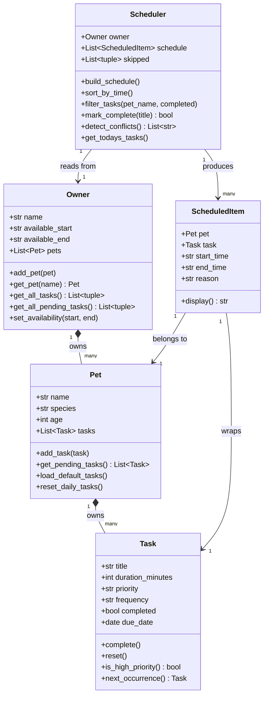

# PawPal+ 🐾

A Streamlit app that helps a pet owner plan and manage daily care tasks across multiple pets — built with a custom scheduling engine, automated tests, and a clean UI.

**Built by:** Yerlandana
**Course:** AI110 — Module 2 Project

---

## What I Built

PawPal+ is a pet care planning assistant. Given an owner's available time window and a list of care tasks (walks, feeding, grooming, etc.), the app generates a prioritized daily schedule and explains why each task was placed when it was.

The system is built in three layers:
- **`pawpal_system.py`** — pure Python logic (no UI dependency)
- **`app.py`** — Streamlit UI wired to the logic layer
- **`tests/test_pawpal.py`** — 45 automated tests

---

## Features

### Core scheduling
- Register an owner with a custom availability window (e.g. 08:00–20:00)
- Add multiple pets with species-appropriate default tasks (dog/cat)
- Add custom care tasks with title, duration, priority, and recurrence frequency
- Generate a daily schedule sorted by priority, then by duration

### Smarter scheduling algorithms

| Feature | Method | How it works |
|---|---|---|
| **Priority sorting** | `build_schedule()` | High → medium → low; shorter tasks first within same tier |
| **Sort by time** | `sort_by_time()` | Orders schedule by start time using a lambda key on zero-padded `"HH:MM"` strings |
| **Filter tasks** | `filter_tasks(pet_name, completed)` | Returns a filtered view by pet name and/or completion status |
| **Recurring tasks** | `Task.next_occurrence()` | When a daily/weekly task is marked complete, `timedelta` computes the next due date and appends a fresh task automatically |
| **Conflict detection** | `detect_conflicts()` | Checks every pair of slots with `A.start < B.end AND B.start < A.end`; returns warning strings instead of raising exceptions |
| **Skipped task reporting** | `Scheduler.skipped` | Tasks that don't fit the time window are stored and surfaced to the user — never silently dropped |

### UI features
- View toggle: All tasks / Sorted by time / Pending only / Completed only
- Per-pet filter dropdown
- Conflict warnings displayed as prominent error banners
- Mark tasks complete directly in the app (triggers automatic recurrence)
- Skipped tasks shown in an expander with an actionable tip
- Progress counter (e.g. "2/7 completed")

---

## 📸 Demo

> Run `streamlit run app.py` to launch the app locally.

<a href="/course_images/ai110/pawpal_screenshot.png" target="_blank">
  
</a>

---

## System Architecture (UML)



---

## Getting Started

```bash
python -m venv .venv
source .venv/bin/activate       # Windows: .venv\Scripts\activate
pip install -r requirements.txt
streamlit run app.py
```

To run the CLI demo:
```bash
python main.py
```

---

## Testing PawPal+

```bash
python -m pytest
```

**45 tests** across five categories:

| Category | What's covered |
|---|---|
| Task lifecycle | `complete()`, `reset()`, priority ordering, recurrence for daily/weekly/as-needed |
| Pet ownership | add/remove tasks, pending/completed filtering, species defaults |
| Owner aggregation | cross-pet task access, empty-owner edge cases |
| Scheduler algorithms | build, sort by time, filter by pet/status, mark-complete with recurrence |
| Conflict detection | overlapping slots flagged, adjacent slots not flagged, cross-pet conflicts |

**Confidence: ★★★★☆** — all happy paths and most edge cases covered.

Known gaps:
- `_add_minutes()` doesn't handle midnight overflow (e.g. 23:30 + 60 min)
- Streamlit UI layer not covered by automated tests
- `reset_daily_tasks()` not tested across a full day cycle

---

## Project Structure

```
pawpal_system.py   # Core logic: Task, Pet, Owner, ScheduledItem, Scheduler
app.py             # Streamlit UI
main.py            # CLI demo script
tests/
  test_pawpal.py   # 45 automated tests
reflection.md      # Design decisions, tradeoffs, AI collaboration notes
```

---

## Reflection

See [reflection.md](reflection.md) for full design notes including:
- UML class diagram evolution (initial → final)
- Scheduling logic constraints and tradeoffs
- AI collaboration strategy — what worked, what was rejected
- Testing confidence assessment and known limitations
