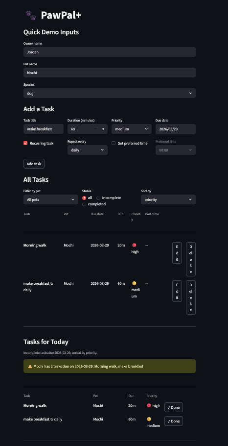

# PawPal+

A Streamlit app that helps pet owners plan and track daily care tasks for one or more pets.
It generates a prioritized daily schedule, warns about timing conflicts, and remembers recurring routines automatically.

---

## 📸 Demo

<a href="pawpalplus_app.png" target="_blank"></a>

---

## Features

### Task management
- **Add tasks** with a title, duration, priority (low / medium / high), due date, and an optional preferred start time.
- **Edit or delete** any task inline — changes persist immediately to `owner.json`.
- **Multi-pet support** — tasks are stored per-pet and labelled so the schedule always shows which pet each task belongs to.
- **Completion tracking** — mark a task done with one click; completed tasks appear with strikethrough in the task list.

### Smart scheduling (`Scheduler.generate_schedule`)
- **Priority-first placement** — tasks are sorted by priority (high → low) before being placed in the time window, so feeding and medication always get a slot before lower-urgency tasks.
- **Preferred-time honoring** — if an owner sets a preferred start time for a task, the scheduler places the task at that exact time as long as the slot is still free and the task fits before the window closes.
- **Buffer gaps** — a configurable gap (default 10 min) is automatically inserted between consecutive tasks.
- **Dropped-task reporting** — tasks that cannot fit in the available window are returned in a separate `dropped` list and surfaced as a `st.warning` in the UI, so no task is silently lost.

### Next-available-slot finder (`Scheduler.next_available_slot`)
- Given a list of already-scheduled tasks and a desired duration, returns the **earliest start time** in the day's window where a new task fits without overlapping anything already on the schedule.
- The algorithm builds a sorted list of occupied intervals, then walks each gap between them (plus the leading and trailing tails of the window) until it finds a gap wide enough for `duration + buffer` on both sides.
- Runs in O(n log n) time (dominated by sorting the occupied intervals); the scan itself is O(n).
- Useful for the "suggest a time" feature: instead of asking the owner to pick a slot, the app can surface the next open window automatically.

**How Agent Mode was used to implement this:**
I prompted Claude Code's agentic mode with: *"Add a `next_available_slot(tasks, duration)` method to the `Scheduler` class in `pawpal_system.py`. It should scan the available window for the first gap that fits the requested duration, respecting buffer gaps around already-scheduled tasks, and return the start time in minutes from midnight or None."* The agent planned the interval-gap approach, wrote the method with full type hints and a docstring, and inserted it into the class without touching any surrounding logic. I reviewed the algorithm against the existing `generate_schedule` design to confirm the buffer semantics matched.

### Conflict detection (`Scheduler.detect_conflicts`)
- After a schedule is generated, every pair of scheduled tasks is checked for overlapping time slots — including tasks belonging to different pets.
- The algorithm sorts tasks by start time first, then uses an early-break inner loop: once task B starts at or after task A ends, no later task can overlap A either, keeping checks fast even for long lists.
- Overlaps are returned as plain-English strings (e.g. `'Morning walk [Mochi] (8:00 AM, 20 min) overlaps with …'`).

### Sorting and filtering
- **Sort by priority** (`Scheduler.sort_tasks_by_priority`) — highest-priority tasks listed first; ties broken by whether the task is due today.
- **Sort by due date / start time** (`Scheduler.sort_tasks_by_time`) — chronological order; tasks with no due date sort last.
- **Sort by duration** — shortest tasks first, useful for quick-win planning.
- **Filter by pet** — view tasks for one pet or all pets at once.
- **Filter by status** — show all tasks, only incomplete, or only completed.

### Recurring tasks
- **Daily recurrence** — marking a daily task complete automatically creates the next occurrence due tomorrow, with the same name, duration, priority, and preferred time.
- **Weekly recurrence** — same behaviour with a 7-day offset.
- Duplicate-prevention guard: adding a recurring task whose name already exists for that pet (e.g. on app reload) is silently skipped to avoid stacking identical tasks.

### Proactive daily warnings
- Before the owner clicks "Generate schedule," the app scans today's incomplete tasks and emits a `st.warning` for every pet that has two or more tasks due on the same day — a heads-up about a busy schedule before any commitment is made.

### Visual priority indicators
- Every task row uses colour-coded badges — 🔴 high, 🟡 medium, 🟢 low — in the task list, the "Tasks for Today" panel, and the generated schedule table.

### Persistent storage (`OwnerRepository`)
- Owner, pet, and task data is serialized to `owner.json` after every change (add, edit, delete, complete).
- On next launch the app reloads the saved state automatically; no manual save step required.

---

## Getting started

### Requirements

- Python 3.10+
- Dependencies listed in `requirements.txt`

### Setup

```bash
python -m venv .venv
source .venv/bin/activate   # Windows: .venv\Scripts\activate
pip install -r requirements.txt
```

### Run the app

```bash
streamlit run app.py
```

---

## Running the tests

```bash
python -m pytest tests/test_pawpal.py -v
```

All 34 tests pass in under a second.

### Test coverage summary

| Category | Tests | What is verified |
|---|---|---|
| **Sorting correctness** | 3 | `sort_tasks_by_time()` returns tasks in chronological order; `due_time=None` always sorts last; ties broken by `start_time` |
| **Recurrence logic** | 5 | Completing a daily task returns a new task due tomorrow; weekly returns +7 days; returned task inherits name, duration, priority, and pet; non-recurring returns `None` and flips `completed=True` |
| **Conflict detection** | 6 | Overlapping pairs produce a warning string; same start time is caught; tasks ending exactly when the next begins is not flagged; empty list is safe |
| **Priority scheduling** | 4 | Highest-priority task is placed first; buffer is applied between tasks; tasks too long for the window are dropped, not lost; empty input returns empty output |
| **Pet & Owner operations** | 7 | Add/remove/update tasks; `ValueError` on missing task IDs; tasks aggregate correctly across multiple pets; future-dated tasks are excluded from today's view |
| **Edge cases** | 3 | Pet with no tasks returns `[]`; task longer than the full available window lands in `dropped`; `detect_conflicts([])` does not crash |

### Confidence level: 4 / 5

The core scheduling behaviours — priority ordering, conflict detection, and recurring task creation — are each covered by multiple tests probing both the happy path and boundary conditions. One star held back because the `preferred_time` fallback path inside `generate_schedule()` (when a preferred slot is already occupied) has no direct test.

---

## Project structure

```
app.py               # Streamlit UI
pawpal_system.py     # Domain classes: Task, Pet, Owner, Scheduler, OwnerRepository
tests/
  test_pawpal.py     # Automated test suite (pytest)
owner.json           # Persisted owner/pet/task data (auto-created on first run)
uml_final.png        # Final class diagram
requirements.txt
```
