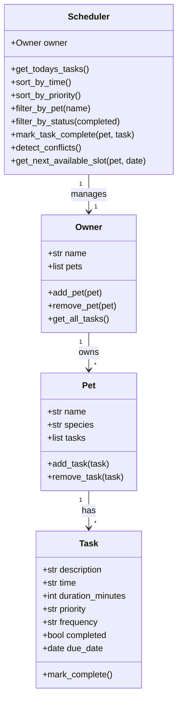

# PawPal+ (Module 2 Project)

**PawPal+** is a Streamlit app that helps a pet owner plan and track care tasks for their pets.

## Scenario

A busy pet owner needs help staying consistent with pet care. They want an assistant that can:

- Track pet care tasks (walks, feeding, medications, enrichment, grooming, etc.)
- Consider constraints (time, priority, recurrence)
- Produce a daily plan, detect scheduling conflicts, and explain the reasoning

## What was built

| Feature | Location |
|---|---|
| Core logic (Owner, Pet, Task, Scheduler) | `pawpal_system.py` |
| CLI demo script | `main.py` |
| Streamlit UI | `app.py` |
| Automated tests (14) | `tests/test_pawpal.py` |

### System architecture (UML)



## Smarter Scheduling

Beyond basic storage, the Scheduler implements four algorithms:

1. **Sorting by time** — Uses `sorted()` with a `lambda` key on the zero-padded HH:MM string.  Lexicographic order equals chronological order for 24-hour times, so no datetime parsing is needed.

2. **Sorting by priority** — A rank dictionary `{"high": 0, "medium": 1, "low": 2}` is used as the primary sort key, with time as a tiebreaker.

3. **Recurring tasks** — When `mark_task_complete()` is called on a daily or weekly task, a new Task is created with `due_date + timedelta(days=1)` or `timedelta(weeks=1)` and automatically added to the pet.

4. **Conflict detection** — `detect_conflicts()` builds a dictionary keyed on `(pet_name, due_date, time)`.  Any duplicate key is flagged as a conflict warning.  A bonus method, `get_next_available_slot()`, scans 07:00–21:30 in 30-minute increments to suggest the next free time for a pet.

## Getting started

```bash
python -m venv .venv
source .venv/bin/activate  # Windows: .venv\Scripts\activate
pip install -r requirements.txt
```

Run the CLI demo:

```bash
python main.py
```

Run the Streamlit app:

```bash
streamlit run app.py
```

## Testing PawPal+

Run all tests:

```bash
python -m pytest
```

Or with verbose output:

```bash
python -m pytest tests/test_pawpal.py -v
```

### What the tests cover

| Test | Behavior verified |
|---|---|
| `test_task_completion_changes_status` | `mark_complete()` flips `completed` to True |
| `test_adding_task_increases_pet_count` | Adding a task grows `pet.tasks` |
| `test_sort_by_time_returns_chronological_order` | Tasks returned in ascending HH:MM order |
| `test_sort_by_priority_high_before_low` | High-priority tasks appear first |
| `test_daily_task_creates_next_occurrence` | Daily task → new task for next day |
| `test_weekly_task_creates_next_occurrence` | Weekly task → new task 7 days later |
| `test_once_task_does_not_recur` | One-time task creates no follow-up |
| `test_conflict_detection_flags_same_time` | Same pet, same time → warning |
| `test_no_conflict_for_different_times` | Different times → no warning |
| `test_no_conflict_for_different_pets` | Same time, different pets → no warning |
| `test_filter_by_pet_returns_only_that_pet` | Filter returns only named pet's tasks |
| `test_filter_by_status_incomplete` | Status filter excludes completed tasks |
| `test_pet_with_no_tasks` | Empty pet list returns `[]` without error |
| `test_get_next_available_slot` | Slot finder skips occupied times correctly |

**Confidence level: ⭐⭐⭐⭐ (4/5)** — Happy paths and key edge cases are fully covered.  Duration-overlap detection and midnight-spanning schedules are noted as future improvements.
