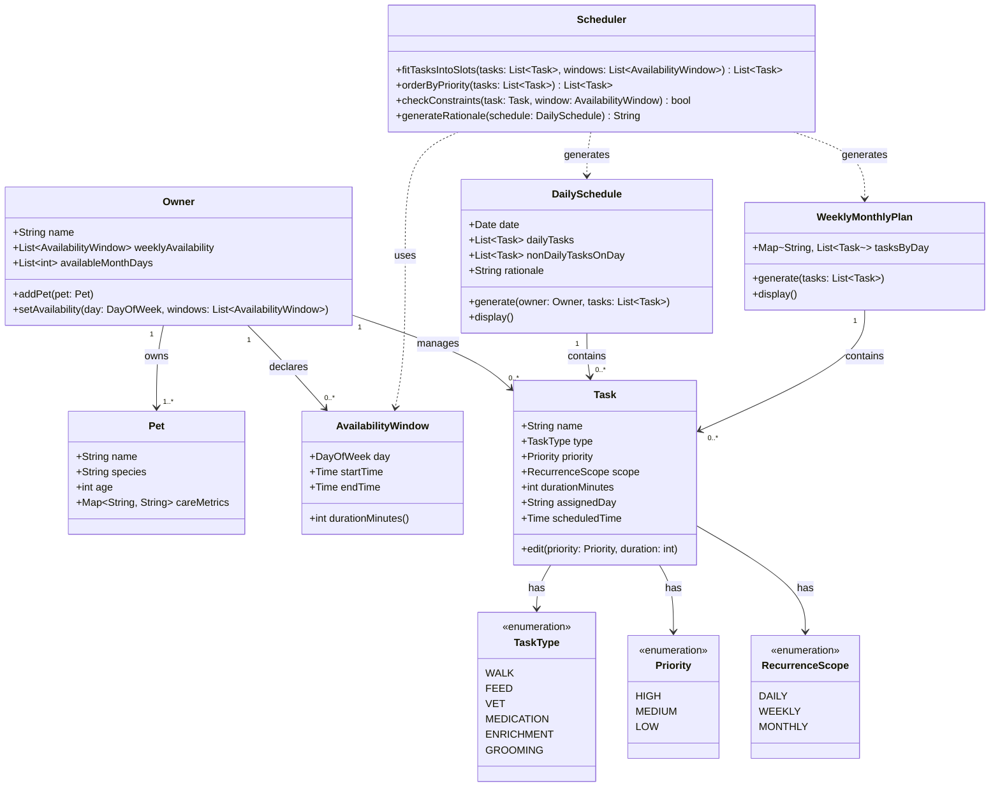

# PawPal+ UML Class Diagram

```mermaid
classDiagram
    class Owner {
        +String name
        +List~AvailabilityWindow~ weeklyAvailability
        +List~int~ availableMonthDays
        +addPet(pet: Pet)
        +setAvailability(day: DayOfWeek, windows: List~AvailabilityWindow~)
    }

    class Pet {
        +String name
        +String species
        +int age
        +Map~String, String~ careMetrics
    }

    class AvailabilityWindow {
        +DayOfWeek day
        +Time startTime
        +Time endTime
        +int durationMinutes()
    }

    class Task {
        +String name
        +TaskType type
        +Priority priority
        +RecurrenceScope scope
        +int durationMinutes
        +String assignedDay
        +Time scheduledTime
        +edit(priority: Priority, duration: int)
    }

    class TaskType {
        <<enumeration>>
        WALK
        FEED
        VET
        MEDICATION
        ENRICHMENT
        GROOMING
    }

    class Priority {
        <<enumeration>>
        HIGH
        MEDIUM
        LOW
    }

    class RecurrenceScope {
        <<enumeration>>
        DAILY
        WEEKLY
        MONTHLY
    }

    class DailySchedule {
        +Date date
        +List~Task~ dailyTasks
        +List~Task~ nonDailyTasksOnDay
        +String rationale
        +generate(owner: Owner, tasks: List~Task~)
        +display()
    }

    class WeeklyMonthlyPlan {
        +Map~String, List~Task~~ tasksByDay
        +generate(tasks: List~Task~)
        +display()
    }

    class Scheduler {
        +fitTasksIntoSlots(tasks: List~Task~, windows: List~AvailabilityWindow~) List~Task~
        +orderByPriority(tasks: List~Task~) List~Task~
        +checkConstraints(task: Task, window: AvailabilityWindow) bool
        +generateRationale(schedule: DailySchedule) String
    }

    Owner "1" --> "1..*" Pet : owns
    Owner "1" --> "0..*" AvailabilityWindow : declares
    Owner "1" --> "0..*" Task : manages
    Task --> TaskType : has
    Task --> Priority : has
    Task --> RecurrenceScope : has
    DailySchedule "1" --> "0..*" Task : contains
    WeeklyMonthlyPlan "1" --> "0..*" Task : contains
    Scheduler ..> DailySchedule : generates
    Scheduler ..> WeeklyMonthlyPlan : generates
    Scheduler ..> AvailabilityWindow : uses
```
