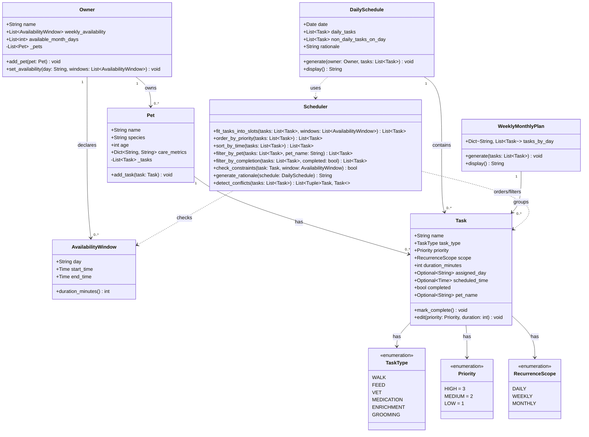

# PawPal+ UML Class Diagram

```mermaid
classDiagram
    class Owner {
        +String name
        +List~AvailabilityWindow~ weekly_availability
        +List~int~ available_month_days
        -List~Pet~ _pets
        +add_pet(pet: Pet) void
        +set_availability(day: String, windows: List~AvailabilityWindow~) void
    }

    class Pet {
        +String name
        +String species
        +int age
        +Dict~String, String~ care_metrics
        -List~Task~ _tasks
        +add_task(task: Task) void
    }

    class AvailabilityWindow {
        +String day
        +Time start_time
        +Time end_time
        +duration_minutes() int
    }

    class Task {
        +String name
        +TaskType task_type
        +Priority priority
        +RecurrenceScope scope
        +int duration_minutes
        +Optional~String~ assigned_day
        +Optional~Time~ scheduled_time
        +bool completed
        +Optional~String~ pet_name
        +mark_complete() void
        +edit(priority: Priority, duration: int) void
    }

    class TaskType {
        <<enumeration>>
        WALK
        FEED
        VET
        MEDICATION
        ENRICHMENT
        GROOMING
    }

    class Priority {
        <<enumeration>>
        HIGH = 3
        MEDIUM = 2
        LOW = 1
    }

    class RecurrenceScope {
        <<enumeration>>
        DAILY
        WEEKLY
        MONTHLY
    }

    class DailySchedule {
        +Date date
        +List~Task~ daily_tasks
        +List~Task~ non_daily_tasks_on_day
        +String rationale
        +generate(owner: Owner, tasks: List~Task~) void
        +display() String
    }

    class WeeklyMonthlyPlan {
        +Dict~String, List~Task~~ tasks_by_day
        +generate(tasks: List~Task~) void
        +display() String
    }

    class Scheduler {
        +fit_tasks_into_slots(tasks: List~Task~, windows: List~AvailabilityWindow~) List~Task~
        +order_by_priority(tasks: List~Task~) List~Task~
        +sort_by_time(tasks: List~Task~) List~Task~
        +filter_by_pet(tasks: List~Task~, pet_name: String) List~Task~
        +filter_by_completion(tasks: List~Task~, completed: bool) List~Task~
        +check_constraints(task: Task, window: AvailabilityWindow) bool
        +generate_rationale(schedule: DailySchedule) String
        +detect_conflicts(tasks: List~Task~) List~Tuple~Task, Task~~
    }

    Owner "1" --> "0..*" Pet : owns
    Owner "1" --> "0..*" AvailabilityWindow : declares
    Pet "1" --> "0..*" Task : has
    Task --> TaskType : has
    Task --> Priority : has
    Task --> RecurrenceScope : has
    DailySchedule "1" --> "0..*" Task : contains
    DailySchedule ..> Scheduler : uses
    WeeklyMonthlyPlan "1" --> "0..*" Task : groups
    Scheduler ..> AvailabilityWindow : checks
    Scheduler ..> Task : orders/filters
```
