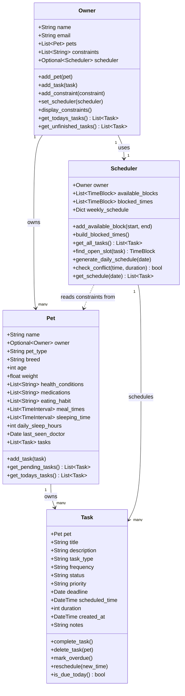

# PawPal+ Project Reflection

## 1. System Design

**a. Initial design**

The system is built around four classes: **Owner**, **Pet**, **Task**, and **Scheduler**.

**Owner** is the central user of the app. It holds the owner's identity, their list of pets, their lifestyle constraints, and a reference to their personal Scheduler. It exposes methods to add pets, log constraints, and access tasks across all their pets.

**Pet** stores all profile data for a single animal including breed, health conditions, medications, sleep schedule, and eating habits. It holds a reference back to its Owner and owns its own list of Tasks.

**Task** represents a single care action (grooming, feeding, vet visit, etc.) linked to a specific Pet. It has a description, a frequency (once, daily, weekly, monthly), priority, status, deadline, and duration so the Scheduler can slot it into the day.

**Scheduler** is the scheduling engine. It reads the Owner's constraints and each Pet's sleep and eating windows to build a list of blocked times, then fits Tasks into the remaining free windows by priority and deadline.

**Relationships:**

| Relationship | Type |
|---|---|
| Owner → Pet | one-to-many (Owner owns Pets) |
| Pet → Task | one-to-many (Pet directly owns its Tasks) |
| Owner → Scheduler | one-to-one (Owner has one Scheduler) |
| Scheduler ⇢ Pet | dependency (reads Pet sleep/eat times as constraints) |

**b. Design changes**

- Did your design change during implementation?
- If yes, describe at least one change and why you made it.

- The current implementation created a dependency between owner and scheduler that needs one to exist to create another.. and thats not correct..

I made scheduler optional when creating Owner
resaon for the change: (Owner and Scheduler each require the other in their __init__. You can't construct either one first. Making scheduler optional on Owner breaks that: you create Owner first, then create Scheduler with that Owner, then call owner.set_scheduler(scheduler) to connect them.)

The type of Pet.owner is wrong, it says type Owner but has a default value of None..

I made the Owner of Pet default to None, and gave it an optional type, because every Pet 'exists' before it gets an Owner

- Task has no reference to its Owner, so delete_task would not really work

I fixed this by passing owner as a parameter to delete_task(), for a task to be deleted it has to be cleared from the owner's schedule and so it needs an owner

- available_blocks hold the Owner's free time, but there's no methond to populate it, build_blocked_times() has nothing to subtract

- pet.eating_habit as a list of strs is not very usable for build_blocked_times()
I added meal_times so that the scheduler know when the pets eating habits start and stop and can factor that into build_blocked_times()

owner.tasks and scheduler.weekly_schedule might present a case where there are two sources of truth..

I changed the design such that scheduler.weekly_schedule is rebuilt from owner.tasks so there are no diverging sources of information

I also realized tasks should live on the Pet not the Owner. The spec says Pet stores its own tasks so I moved the task list from Owner to Pet. Owner now just collects them across all pets when needed.

I added description and frequency to Task because the spec says tasks need to track what they involve and how often they repeat. frequency is what lets the Scheduler know if a task needs to show up every day or just once.

## 2. Scheduling Logic and Tradeoffs

**a. Constraints and priorities**

- What constraints does your scheduler consider (for example: time, priority, preferences)?
- How did you decide which constraints mattered most?

**b. Tradeoffs**

- Describe one tradeoff your scheduler makes.
- Why is that tradeoff reasonable for this scenario?

---

## 3. AI Collaboration

**a. How you used AI**

- How did you use AI tools during this project (for example: design brainstorming, debugging, refactoring)?
- What kinds of prompts or questions were most helpful?

**b. Judgment and verification**

- Describe one moment where you did not accept an AI suggestion as-is.
- How did you evaluate or verify what the AI suggested?

---

## 4. Testing and Verification

**a. What you tested**

- What behaviors did you test?
- Why were these tests important?

**b. Confidence**

- How confident are you that your scheduler works correctly?
- What edge cases would you test next if you had more time?

---

## 5. Reflection

**a. What went well**

- What part of this project are you most satisfied with?

**b. What you would improve**

- If you had another iteration, what would you improve or redesign?

**c. Key takeaway**

- What is one important thing you learned about designing systems or working with AI on this project?
