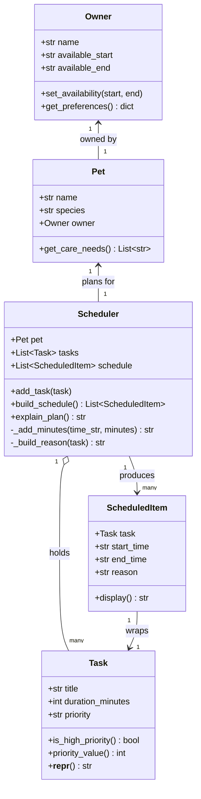

# PawPal+ Project Reflection

## 1. System Design

**a. Initial design**

The system is a pet care planning assistant. Based on the app structure, three core user actions drive the design:

1. **Register a pet** — user enters their name, their pet's name, and the pet's species. 

2. **Add a care task** — A user defines a task (e.g., "Morning walk") with a title, estimated duration in minutes, and a priority level (low, medium, high). 

3. **Generate a daily schedule** — The user triggers the scheduler, which takes the current list of tasks and produces an ordered daily plan. The scheduler selects and sequences tasks based on priority and duration constraints, then explains why each task was included and when it is placed.

**Classes and responsibilities:**

- **`Owner`** consists attributes 'name' and `available_hours`
 Methods: `set_availability()`, `get_preferences()`

- **`Pet`** — 
attribtes:  `name`, `species`, and a reference to its `Owner`
Methods: `get_care_needs()` to return species-appropriate default tasks.

- **`Task`** — 
attributes: `title`, `duration_minutes`, and `priority` (low/medium/high)
 Methods: `is_high_priority()` and `__repr__()` for display.

- **`Scheduler`** 
attributes: `Pet`, a list of `Task` objects, and the resulting `schedule`
 Methods: `add_task()`, `build_schedule()` 

- **`ScheduledItem`** 
attributes:  `Task`, `start_time`, `end_time`, and a `reason` string
 Methods: `display()`

**UML Class Diagram (Mermaid.js):**

**b. Design changes**

After reviewing the skeleton in `pawpal_system.py`, three bottlenecks were identified:

1. **`Pet.get_care_needs()` returns strings, not `Task` objects.** The method produces a list of title strings, but the `Scheduler` expects `Task` objects. There is no bridge between them, so the species defaults can't be used directly. *Fix needed:* either change `get_care_needs()` to return `Task` objects with sensible defaults, or add a factory helper.

2. **`build_schedule()` silently drops tasks that don't fit.** When a task exceeds the available time window the loop `break`s, but the skipped tasks are never reported. A user has no way to know their low-priority tasks were dropped. *Fix needed:* collect skipped tasks and return or surface them separately.

3. **`Task` has no `preferred_time` attribute.** Some tasks (e.g. "Morning walk", "Evening feeding") are inherently time-bound. Without a preferred time slot, the scheduler cannot respect natural care rhythms. *Deferred for now* — the current priority-based ordering is a reasonable first approximation.

---

## 2. Scheduling Logic and Tradeoffs

**a. Constraints and priorities**

The scheduler considers three constraints, in this priority order:

1. **Task priority** (high → medium → low) — the most important constraint. A missed high-priority task (e.g., medication, feeding) has real consequences for the pet's wellbeing, so it must be scheduled first regardless of duration.
2. **Owner availability window** (`available_start` / `available_end`) — tasks cannot be placed outside this window. Tasks that don't fit are moved to `skipped` and reported to the user.
3. **Task duration** — within the same priority tier, shorter tasks are scheduled first to maximise the number of tasks that fit before the window closes.

**b. Tradeoffs**

**Conflict detection checks for exact time overlaps, not duration-aware overlaps.**

The `detect_conflicts()` method uses a pairwise O(n²) interval comparison: two items conflict if `A.start < B.end AND B.start < A.end`. This correctly catches all overlapping slots.

The tradeoff is that the current `build_schedule()` assigns tasks sequentially — it never actually creates an overlap. Conflicts can only arise if tasks are injected manually (e.g., via the Streamlit UI in a future iteration where users pick specific start times). Keeping conflict detection as a separate post-build check, rather than baking it into the scheduling loop, keeps the two concerns independent and easier to test. The O(n²) cost is acceptable for a typical day of pet care tasks (< 20 items); a sweep-line algorithm would be needed at scale.

---

## 3. AI Collaboration

**a. How you used AI**

- How did you use AI tools during this project (for example: design brainstorming, debugging, refactoring)?
- What kinds of prompts or questions were most helpful?

**b. Judgment and verification**

- Describe one moment where you did not accept an AI suggestion as-is.
- How did you evaluate or verify what the AI suggested?

---

## 4. Testing and Verification

**a. What you tested**

- What behaviors did you test?
- Why were these tests important?

**b. Confidence**

- How confident are you that your scheduler works correctly?
- What edge cases would you test next if you had more time?

---

## 5. Reflection

**a. What went well**

- What part of this project are you most satisfied with?

**b. What you would improve**

- If you had another iteration, what would you improve or redesign?

**c. Key takeaway**

- What is one important thing you learned about designing systems or working with AI on this project?
