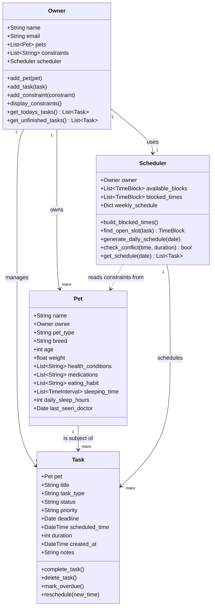

# PawPal+ Project Reflection

## 1. System Design

**a. Initial design**

- Briefly describe your initial UML design.
- What classes did you include, and what responsibilities did you assign to each?

The initial relationships beyween thse models is his:
Owner ----< Pet       (one-to-many)
Owner ----< Task      (one-to-many)
Pet   ----< Task      (one-to-many — tasks belong to specific pets!)
Owner ---- Scheduler  (one-to-one, Owner uses a Scheduler)

I thought first about the Owner Model, the owner,
Attributes:
- Name,
- Email for authentication 
- Pets (instances of the Pet Model)
- constraints (lifestyle restrictions that hinder pet grooming time, list of strings)
- scheduler (reference to the owner's personal scheduler class)

Methods:
- get_unfinished_tasks() (instances of Task Model in a list)
- get_todays_tasks() (instances of Task Model in a list)
- add_pet
- add_constraint
- display_constraints
- add_task

The pet model should store all information regarding the Pet and its connectoin to its owner

The Pet Model:
Attributes:
- name
- owner - reference to the Pet's owner
- age
- breed
- medications (list of strings)
- weight
- pet_type (general) e.g Dog, cat, etc
- health_conditions (list of strings)
- eating_habit (list of strings)
- sleeping_time (list of time intervals)
- daily_sleep_hours (number of hours, integer)
- last_seen_doctor (date)

The task model connects the Scheduler and the pet being taken care of at any time
The Task Model:
Attributes:
- pet
- task_type
- status
- priority
- title
- deadline
- duration
- created_at (power's owners display todays_tasks)

Methods:
- mark_overdue
- complete_task
- delete_task
- reschedule(new_time)

the scheduler model controls the user's times and manages plus optimozes for time to take care of the Owner's pet
Scheduler Model
Attributes: 
- owner
- available_time (how many hours they have for pet grooming)
- blocked_times
- weekly_schedule

Methods:
- build_blocked_times()
- find_open_slots()
- generate_daily_schedule
- check_conflict(time, duration)
- get_schedule(date)

**b. Design changes**

- Did your design change during implementation?
- If yes, describe at least one change and why you made it.

---

## 2. Scheduling Logic and Tradeoffs

**a. Constraints and priorities**

- What constraints does your scheduler consider (for example: time, priority, preferences)?
- How did you decide which constraints mattered most?

**b. Tradeoffs**

- Describe one tradeoff your scheduler makes.
- Why is that tradeoff reasonable for this scenario?

---

## 3. AI Collaboration

**a. How you used AI**

- How did you use AI tools during this project (for example: design brainstorming, debugging, refactoring)?
- What kinds of prompts or questions were most helpful?

**b. Judgment and verification**

- Describe one moment where you did not accept an AI suggestion as-is.
- How did you evaluate or verify what the AI suggested?

---

## 4. Testing and Verification

**a. What you tested**

- What behaviors did you test?
- Why were these tests important?

**b. Confidence**

- How confident are you that your scheduler works correctly?
- What edge cases would you test next if you had more time?

---

## 5. Reflection

**a. What went well**

- What part of this project are you most satisfied with?

**b. What you would improve**

- If you had another iteration, what would you improve or redesign?

**c. Key takeaway**

- What is one important thing you learned about designing systems or working with AI on this project?
