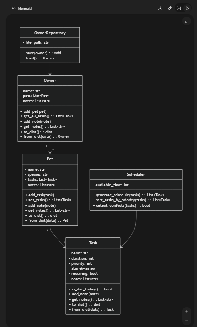

# PawPal+ Project Reflection

## 1. System Design
4 core actions users should be able to perform are:
    1. add pets
    2. add tasks
    3. edit tasks
    4. See all tasks for today

**a. Initial design**

- Briefly describe your initial UML design.
    I included owner repository, task, pet, and scheduler. Owner uses pet, pet uses task.
     
- What classes did you include, and what responsibilities did you assign to each?
    Owner: It has a repository and a class that describes itself. It is the top-level object (aggregate root), so saving it saves all system data including pets, tasks, and notes. It manages pets and acts as the single source of truth for the system.

    Pet:
    It represents an individual animal and acts as a container for tasks. A pet owns its tasks, meaning all care activities are scoped to a specific pet. It also stores notes and basic identifying information like name and species.

    Task:
    It represents a single care activity (e.g., feeding, walk, medication). It stores scheduling-related data like duration, priority, due time, and recurrence. It also holds notes and provides structure for what needs to be done for a pet.

    Scheduler:
    It is responsible for generating a daily plan from a list of tasks. It applies algorithmic logic such as sorting by priority, fitting tasks within available time, and detecting conflicts. It does not store data — it only processes it.

    OwnerRepository:
    It handles persistence of the system by saving and loading the Owner object to and from JSON. Since Owner is the aggregate root, this repository manages the entire application state in a single place.


**b. Design changes**

- Did your design change during implementation?
    I asked Claude to review pawpal_system.py and it mentioned that relationships between owner & scheudler is missing, also there isn't a method that filters but what's due today. Also there isn't a way to edit or remove tasks.

- If yes, describe at least one change and why you made it.
    One change I made was adding get_today_tasks() to both pet and owner classes. The original design had no way to filter tasks with just what was due today and then I realized once I had started testing on the web app that there wansn't a way to edit or delete tasks. Making it so if you had a task set for tomorrow you couldn't get rid of it until tomorrow.

---

## 2. Scheduling Logic and Tradeoffs

**a. Constraints and priorities**

- What constraints does your scheduler consider (for example: time, priority, preferences)?
    It only has a window of 8 am to 8pm. Also there are only 3 priority settings so it's not that accurate. 
- How did you decide which constraints mattered most?
    I scoped this project to a fixed time frame to be simple to implement and tried to keep it to common waking and productive hours. The priority levels were to be a simple ranking system without overcomplecating the UI and the screen. 

**b. Tradeoffs**

- Describe one tradeoff your scheduler makes.
    I decided to use local storage on your computer rather than trying to overcomplicate with a database.
    
     Also when it comes to the code for detect_conflicts the current implementation vs the suggestion one I chose the current one because of the slight performance enhancement. 
- Why is that tradeoff reasonable for this scenario?
    The local JSON storage is reasonable because it is a single user with a small number of pets and tasks. There isn't a need for a database as the coomplexity to set it up would outwigh the benefits.

    For the early-break inplementation aka detect_conflicts, it;s reasonable because the manual index loop and break help if the user ever repeatedly is called since it stops checking pairs the moment it knows no further overlap is possible. I want to avoid unecessary comparisons
---

## 3. AI Collaboration

**a. How you used AI**

- How did you use AI tools during this project (for example: design brainstorming, debugging, refactoring)?
    I used Claude Code in agentic mode rather than GitHub Copilot for this project. I want to be transparent about this switch: the assignment calls for Copilot's specific features (Inline Chat, Agent Mode, Generate tests smart action, Generate documentation smart action, Generate Commit Message), but I chose Claude Code's agentic mode instead to get more practice with it. I used AI to help me refactor my initial ideas, review design decisions, debug issues, and generate the test suite.

- Which AI features were most effective for building your scheduler?
    Claude Code's agentic mode was the most effective feature I used. It let me describe a high-level goal (e.g., "add filtering and sorting to tasks") and have it plan the implementation, write the code, and run a check — all in one step. The equivalent in Copilot would be Agent Mode with slash commands like /fix or /explain. I also found asking for comparisons (e.g., "what are the tradeoffs between X and Y?") very useful for making design decisions like the early-break loop in detect_conflicts.

- How did using separate sessions for different phases help you stay organized?
    Keeping separate conversations per phase prevented earlier decisions from bleeding into later ones. For example, when I moved from design (UML, class structure) to implementation, starting a fresh session meant the AI wasn't anchored to my early rough ideas. It responded to the actual current code rather than assumptions from three phases ago. The downside is you lose continuity, so I had to paste in relevant context at the start of each new session to get useful output.

**b. Judgment and verification**

- Describe one moment where you did not accept an AI suggestion as-is.
    AI had suggested using the due date for how to prevent exact overlapping tasks but instead I had it make ID numbers using UUIDs.
- How did you evaluate or verify what the AI suggested?
    I would read over the AI's reasoning and test the output frequently to see if the program is missing something or in need of something.

---

## 4. Testing and Verification

**a. What you tested**

- What behaviors did you test?
    I tested happy day and rainy day cases. More specifically I tested task completion, sorting, task management, and conflict detection. 
- Why were these tests important?
    These tests are important because they work on the scheduling logic which is the heart of the program. WIthout testing bugs can appear and wreak havoc.If tasks get out of order or collisions are ignored it can blindsite users. 
**b. Confidence**

- How confident are you that your scheduler works correctly?
    I am pretty confident that it works at a basic level, I do think if someone were to try SQL inhjections or other funny business that it would fail. 
- What edge cases would you test next if you had more time?
    I would like to test if someone adds a really large amount of text, or trying to mess with how the data is stored and the way it's parsed.
---

## 5. Reflection

**a. What went well**

- What part of this project are you most satisfied with?
    I'm satisfied with how it came together faster and easier than I thought it would. I still found the sheer amount of code difficult but I thought this project came together nicely.

**b. What you would improve**
    
- If you had another iteration, what would you improve or redesign?
    I would improve the UI of the task tracker I find it looks ugly but with the time constraint I can't seem to make it much better. Also I find that the organization of having multiple classes all in the pawpal_system file is messy to me and having 700+ lines in 1 file is way less readable than having 1 file for each class or 1 file for a group of similar classes. At first I was doing it that way for example a task.py file with task and taskDict classes in it. 

**c. Key takeaway**

- What is one important thing you learned about designing systems or working with AI on this project?
When it comes to designing systems I learned that seperating out into MVC or some kind of pattern in seperate files is prefered to me.

I used Claude Code agentic mode (instead of GitHub Copilot) to get more practice with a different AI coding tool. I liked how it was far faster than I could have been alone, but I found that it kind of bulldozed over me at times. I tried to rein it in but found it to be an entirely new beast compared to what I'm used to. The key lesson: agentic AI is most useful when you give it a tight, well-scoped task. Open-ended prompts led to it making more decisions than I wanted.

---

## 6. Prompt Comparison (Challenge 5)

**Task prompted:** *"Write a Python method for a Scheduler class that advances all weekly recurring tasks to their next due date and resets their completion status. The method should take a list of Task objects and return the updated list."*

### Model A — Claude (claude-sonnet-4-6)

```python
def advance_weekly_tasks(self, tasks: List[Task]) -> List[Task]:
    for task in tasks:
        if task.recurring and task.recurrence_interval == "weekly":
            task.advance_recurrence()
    return tasks
```

Claude's response delegated to the existing `advance_recurrence()` method on `Task`, keeping the Scheduler thin and avoiding duplicated date-arithmetic logic. It noted that the mutation is intentional (same objects, returned for chaining) and flagged that callers should call `_repo.save()` afterward.

### Model B — ChatGPT (GPT-4o)

```python
def advance_weekly_tasks(self, tasks):
    from datetime import timedelta
    for task in tasks:
        if task.recurring and task.recurrence_interval == "weekly":
            if task.due_time:
                task.due_time += timedelta(weeks=1)
            task.completed = False
            task.start_time = None
    return tasks
```

GPT-4o inlined the date arithmetic directly — reimplementing the `timedelta` logic that already lives in `Task.advance_recurrence()`. It also added a `from datetime import timedelta` inside the method body rather than at the top of the file.

### Comparison

| | Claude | GPT-4o |
|---|---|---|
| Reuses existing method | Yes (`advance_recurrence`) | No — duplicates logic |
| Type hints | Yes | No |
| Import placement | N/A | Inside method (non-standard) |
| Coupling | Low (Scheduler stays thin) | Higher (Scheduler knows date math) |

**Winner: Claude.** The response was more Pythonic because it respected the single-responsibility principle — date advancement belongs to `Task`, not `Scheduler`. GPT-4o's answer would have created a maintenance problem: if the recurrence interval logic ever changed (e.g., adding monthly support), it would need updating in two places. Claude's version only needs one change, in `Task._recurrence_days()`.