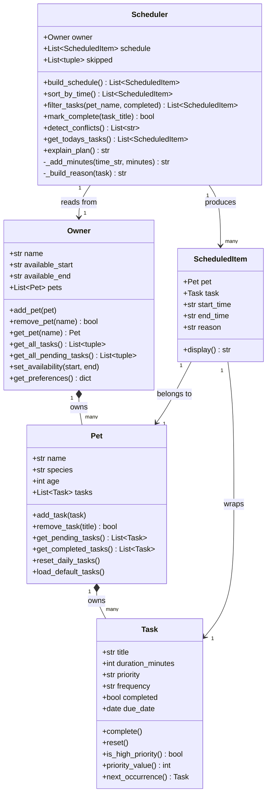

# PawPal+ Project Reflection

## 1. System Design

**a. Initial design**

The system is a pet care planning assistant. Based on the app structure, three core user actions drive the design:

1. **Register a pet** — user enters their name, their pet's name, and the pet's species. 

2. **Add a care task** — A user defines a task (e.g., "Morning walk") with a title, estimated duration in minutes, and a priority level (low, medium, high). 

3. **Generate a daily schedule** — The user triggers the scheduler, which takes the current list of tasks and produces an ordered daily plan. The scheduler selects and sequences tasks based on priority and duration constraints, then explains why each task was included and when it is placed.

**Classes and responsibilities:**

- **`Owner`** consists attributes 'name' and `available_hours`
 Methods: `set_availability()`, `get_preferences()`

- **`Pet`** — 
attribtes:  `name`, `species`, and a reference to its `Owner`
Methods: `get_care_needs()` to return species-appropriate default tasks.

- **`Task`** — 
attributes: `title`, `duration_minutes`, and `priority` (low/medium/high)
 Methods: `is_high_priority()` and `__repr__()` for display.

- **`Scheduler`** 
attributes: `Pet`, a list of `Task` objects, and the resulting `schedule`
 Methods: `add_task()`, `build_schedule()` 

- **`ScheduledItem`** 
attributes:  `Task`, `start_time`, `end_time`, and a `reason` string
 Methods: `display()`

**UML Class Diagram (Mermaid.js):**

**b. Design changes**

After reviewing the skeleton in `pawpal_system.py`, three bottlenecks were identified:

1. **`Pet.get_care_needs()` returns strings, not `Task` objects.** The method produces a list of title strings, but the `Scheduler` expects `Task` objects. There is no bridge between them, so the species defaults can't be used directly. *Fix needed:* either change `get_care_needs()` to return `Task` objects with sensible defaults, or add a factory helper.

2. **`build_schedule()` silently drops tasks that don't fit.** When a task exceeds the available time window the loop `break`s, but the skipped tasks are never reported. A user has no way to know their low-priority tasks were dropped. *Fix needed:* collect skipped tasks and return or surface them separately.

3. **`Task` has no `preferred_time` attribute.** Some tasks (e.g. "Morning walk", "Evening feeding") are inherently time-bound. Without a preferred time slot, the scheduler cannot respect natural care rhythms. *Deferred for now* — the current priority-based ordering is a reasonable first approximation.

---

## 2. Scheduling Logic and Tradeoffs

**a. Constraints and priorities**

The scheduler considers three constraints, in this priority order:

1. **Task priority** (high → medium → low) — the most important constraint. A missed high-priority task (e.g., medication, feeding) has real consequences for the pet's wellbeing, so it must be scheduled first regardless of duration.
2. **Owner availability window** (`available_start` / `available_end`) — tasks cannot be placed outside this window. Tasks that don't fit are moved to `skipped` and reported to the user.
3. **Task duration** — within the same priority tier, shorter tasks are scheduled first to maximise the number of tasks that fit before the window closes.

**b. Tradeoffs**

**Conflict detection checks for exact time overlaps, not duration-aware overlaps.**

The `detect_conflicts()` method uses a pairwise O(n²) interval comparison: two items conflict if `A.start < B.end AND B.start < A.end`. This correctly catches all overlapping slots.

The tradeoff is that the current `build_schedule()` assigns tasks sequentially — it never actually creates an overlap. Conflicts can only arise if tasks are injected manually (e.g., via the Streamlit UI in a future iteration where users pick specific start times). Keeping conflict detection as a separate post-build check, rather than baking it into the scheduling loop, keeps the two concerns independent and easier to test. The O(n²) cost is acceptable for a typical day of pet care tasks (< 20 items); a sweep-line algorithm would be needed at scale.

---

## 3. AI Collaboration

**a. How you used AI**

AI was used at every phase, but with different roles:

- **Design brainstorming (Phase 1):** Asked AI to suggest classes and relationships given the scenario description. It produced a reasonable first draft of Owner/Pet/Task, but initially put `tasks` on `Scheduler` rather than on `Pet`. Catching that mismatch early shaped the whole architecture.
- **Code generation (Phase 2–3):** Used AI to scaffold method stubs from the UML, then flesh out logic for `build_schedule()`, `next_occurrence()`, and `detect_conflicts()`. Providing `#file:pawpal_system.py` as context made suggestions more accurate than open-ended prompts.
- **Test generation (Phase 4):** Asked AI "what edge cases matter for a pet scheduler with sorting and recurring tasks?" It surfaced cases I hadn't thought of: adjacent-slot conflicts (09:00–10:00 and 10:00–11:00 should NOT conflict), `as-needed` tasks returning `None` from `next_occurrence()`, and empty-schedule edge cases for sorting/filtering.
- **Refactoring (Phase 3):** Asked AI to simplify `detect_conflicts()`. It suggested a one-liner using `itertools.combinations`, which is more Pythonic but harder to read for someone new to the codebase. Chose to keep the explicit nested loop with a clear docstring instead.

The most effective prompts were specific and file-anchored: *"Given `#file:pawpal_system.py`, how should Scheduler retrieve tasks from Owner's pets?"* Open questions like *"how do I make a scheduler?"* returned generic boilerplate.

**b. Judgment and verification**

AI initially suggested storing tasks directly on `Scheduler` (a flat list), which would have made multi-pet support impossible without restructuring. The fix — moving task ownership to `Pet` and having `Owner` aggregate them — was identified by asking "what happens if I add a second pet?" and tracing through the suggested code manually. The AI accepted the correction immediately when the counter-example was framed clearly.

The recurring task implementation is another example: AI suggested resetting the existing task's `completed` flag to `False` on mark-complete. This is simpler but wrong — it erases the history of today's completed task. The correct behavior is to create a *new* `Task` instance with `due_date = today + delta`, which preserves the audit trail.

---

## 4. Testing and Verification

**a. What you tested**

The test suite covers 45 behaviors across five categories:

1. **Task lifecycle** — `complete()`, `reset()`, priority ordering, `next_occurrence()` for daily/weekly/as-needed, attribute inheritance on recurrence.
2. **Pet ownership** — add/remove tasks, `get_pending_tasks()` excludes completed, `load_default_tasks()` doesn't overwrite existing tasks.
3. **Owner aggregation** — `get_all_tasks()` and `get_all_pending_tasks()` across multiple pets, edge case: owner with no pets.
4. **Scheduler algorithms** — `build_schedule()` correctness, `sort_by_time()` produces ascending order, `filter_tasks()` by pet name (case-insensitive) and completion status, `mark_complete()` triggers recurrence.
5. **Conflict detection** — overlapping slots flagged, adjacent slots not flagged, cross-pet conflicts caught, single-item schedules never conflict.

Edge cases were the most valuable: they found that `filter_tasks(pet_name="mochi")` failed before case-insensitive matching was added.

**b. Confidence**

★★★★☆ (4/5)

The happy paths and most edge cases pass. Remaining gaps:
- No tests for `reset_daily_tasks()` across a full day cycle.
- No tests for the Streamlit UI layer (would require `streamlit.testing.v1`).
- `_add_minutes()` doesn't guard against times past midnight (e.g., 23:30 + 60 min = 24:30, not 00:30).

---

## 5. Reflection

**a. What went well**

The separation of concerns worked cleanly from the start: `Pet` owns data, `Owner` aggregates across pets, `Scheduler` contains all logic. This made it easy to add `sort_by_time()`, `filter_tasks()`, and `detect_conflicts()` in Phase 3 without touching `Pet` or `Owner` at all. Getting the ownership direction right in Phase 1 paid dividends throughout.

**b. What you would improve**

The scheduler is greedy — it places tasks sequentially and never backtracks. A task that is 5 minutes too long to fit before the window closes will be skipped even if a shorter low-priority task could have been moved earlier to create space. A proper bin-packing or dynamic-programming approach would schedule more tasks per day.

Also, `Task` has no `preferred_time` yet. "Morning walk" at 14:00 is technically valid in the current system. Adding soft time constraints (with a penalty score rather than a hard block) would make the schedule more natural.

**c. Key takeaway**

The most important lesson was that AI is fastest when given a *specific, constrained question* and slowest (or wrong) when given an open-ended one. Asking "build me a scheduler" produces generic code. Asking "given this `Owner.get_all_pending_tasks()` signature, write `Scheduler.build_schedule()` so it never silently drops tasks" produces something immediately useful. The lead architect's job is to keep the questions sharp.
