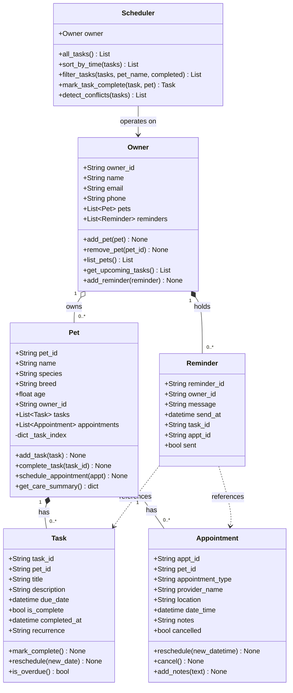

# PawPal+ Project Reflection

## 1. System Design

**a. Initial design**

The initial design uses four classes, each with a single clear responsibility.

**Owner** is the top-level actor. It represents the human user — the person logging in, managing pets, and receiving notifications. It holds contact details and a list of `Pet` objects, and exposes high-level conveniences like `add_pet`, `remove_pet`, and `get_upcoming_tasks` to surface all incomplete tasks across every owned pet in one call.

**Pet** is the central domain object — the thing being cared for. It stores identity information (name, species, breed, age) and a foreign key back to its Owner. It owns two lists — `tasks` and `appointments` — and exposes methods to add items to those lists, mark tasks done, and produce a care summary. Pet is intentionally scoped to a single animal; it has no knowledge of other pets or the owner's full schedule.

**Task** represents one unit of recurring or one-time care: a walk, a feeding, medication, grooming, etc. It stores what needs to be done, when, how often, and whether it's finished. Its methods (`mark_complete`, `reschedule`, `is_overdue`) let the rest of the system query and change the state of that one activity without coupling to Pet or Owner.

**Appointment** represents a scheduled external visit — a vet checkup, vaccination, or grooming session. It is structurally similar to Task but carries different information (provider, location, appointment type) and a different lifecycle: appointments are either kept or cancelled rather than completed and recurred. Keeping it separate from Task avoids a single bloated activity class with too many optional fields.

The four classes form a simple hierarchy: `Owner → Pet → Task / Appointment`. Each layer only knows about the layer directly below it.

**UML class diagram (Mermaid.js):**



**b. Design changes**

Three gaps were identified after drafting the skeleton and running an AI review:

1. **`Task` had no `completed_at` timestamp.** `mark_complete()` set a boolean but discarded the time. This is a bottleneck for recurring tasks: to calculate the next due date, the system needs to know *when* the task was done. Added `completed_at: Optional[datetime] = None`; `mark_complete()` now stamps it with the current time.

2. **No `Reminder` class.** The original design had no object connecting a time-sensitive event to the person who needs to act. Added a `Reminder` dataclass with `owner_id`, an optional `task_id` / `appt_id`, a `message`, a `send_at` datetime, and a `sent` flag. Added `reminders: List[Reminder]` and `add_reminder()` to `Owner`.

3. **`Pet.tasks` list lookup is O(n).** Added a private `_task_index` dict (`task_id → Task`) so internal lookups are O(1) while the public `tasks` list stays simple and iterable.

A fifth class, **`Scheduler`**, was added to own the algorithmic layer (sorting, filtering, recurrence, conflict detection) separately from the data model.

---

## 2. Scheduling Logic and Tradeoffs

**a. Constraints and priorities**

The `Scheduler` considers four constraints:

- **Time (due date):** `sort_by_time()` uses `sorted()` with a `lambda t: t.due_date` key so tasks always surface in chronological order.
- **Completion status:** `filter_tasks(completed=False)` lets the owner focus only on what still needs doing.
- **Pet identity:** `filter_tasks(pet_name="Buddy")` narrows the view to a single animal's workload.
- **Recurrence cadence:** `mark_task_complete()` uses `timedelta(days=1)` or `timedelta(days=7)` to automatically create the next occurrence when a recurring task is finished.

Time ordering was prioritized first because the most common user question is "what do I need to do next?" — which is purely chronological. Recurrence and status filtering reduce noise: completed tasks and scheduled future recurrences shouldn't clutter the current view.

**b. Tradeoffs**

**Conflict detection uses exact timestamp equality, not overlapping durations.** Two tasks are flagged as conflicting only when their `due_date` values are exactly equal. The alternative — checking whether tasks overlap — would require a `duration` field on every Task and range-intersection logic. For a pet care app where tasks are mostly short and point-in-time, exact equality catches the most common real conflict (two reminders set for the same moment) without requiring the user to estimate durations for every entry.

**Recurring task next-occurrence is anchored to completion time, not original due date.** If a daily walk is due at 7 AM but completed at 8 PM, the next occurrence is scheduled for 8 PM the following day rather than 7 AM. This keeps intervals consistent with real behavior but means the schedule can drift if tasks are consistently done late. The alternative — anchoring to the original `due_date` — preserves the intended time but creates increasingly overdue tasks if the owner falls behind.

---

## 3. AI Collaboration

**a. How you used AI**

AI was used across four distinct phases, each in a separate chat session to keep context focused:

- **Design:** Prompted with the four class names, attributes, and methods; asked for a Mermaid.js class diagram. This confirmed the hierarchy and surfaced the missing `Reminder` relationship.
- **Skeleton generation:** Used inline generation for dataclass boilerplate (UUIDs, typed field defaults, `field(default_factory=list)` for mutable defaults).
- **Review:** Asked AI to audit the skeleton for missing relationships and bottlenecks. This produced the `completed_at` field, the `Reminder` class, and the `_task_index` optimization.
- **Testing:** Asked for an edge-case-focused test plan before writing any test code. This surfaced the three-way conflict case and the "completed task should not count as overdue" check.

Using separate sessions for each phase prevented the AI from carrying stale assumptions forward — for example, generating tests against an earlier skeleton rather than the final implementation.

**b. Judgment and verification**

When asking for the recurring task implementation, the AI suggested putting the auto-scheduling logic inside `Task.mark_complete()`. This was rejected because it would have required `Task` to hold a reference to its owning `Pet` to call `pet.add_task()`, creating a circular dependency. The cleaner design keeps `Task.mark_complete()` focused on its own state and delegates "create next occurrence" to `Scheduler.mark_task_complete()`, which already has access to both objects. Catching this required thinking about object ownership, not just whether the code would run.

---

## 4. Testing and Verification

**a. What you tested**

The test suite (`tests/test_pawpal.py`) covers 31 test cases across five categories:

| Category | What is tested |
|---|---|
| **Sorting** | Tasks returned in chronological order; multi-pet interleaving; empty list |
| **Recurrence** | Daily/weekly next-occurrence creation; one-time tasks return `None`; new task added to pet list |
| **Conflict detection** | Same-time tasks flagged; different times pass; completed tasks excluded; three-way conflict |
| **Filtering** | By pet name (case-insensitive), by status, composable (pet + status together) |
| **Edge cases & model** | Empty pet, empty owner, overdue logic, appointment cancel/notes, task index lookup, reminder |

These were prioritized because they cover the core user-facing promises: "show me tasks in order," "remind me again tomorrow," and "warn me if I double-booked."

Run with:

```bash
python -m pytest
```

**b. Confidence**

**★★★★☆ (4/5).** All 31 tests pass. Confidence is high for the algorithmic layer. The main gap is the Streamlit UI, which is not covered by pytest. Conflict detection also only checks exact timestamp equality; overlapping-duration conflicts are not caught. Edge cases I would add with more time: boundary test for `is_overdue()` at the exact current second; filtering across more than two pets; verifying session state persists an `Owner` across Streamlit page reloads.

---

## 5. Reflection

**a. What went well**

The class design held up throughout the build. Having a clear `Owner → Pet → Task/Appointment` hierarchy with `Scheduler` as a separate algorithmic layer meant that adding features (recurrence, conflict detection, filtering) never required changing the data model — new behavior went into `Scheduler` and the model stayed stable. This also made testing clean: each fixture creates an `Owner`, attaches `Pet` objects, and hands everything to a `Scheduler` without mocking anything.

**b. What you would improve**

Conflict detection is the most obvious candidate. The exact-equality check is a reasonable first version, but real scheduling conflicts involve overlapping time ranges. Adding an optional `duration_minutes` field to `Task` and changing `detect_conflicts()` to range-intersection logic would make the warning system genuinely useful for longer tasks like a vet visit or grooming session.

**c. Key takeaway**

AI is a fast, tireless assistant but it has no stake in the outcome. It will generate plausible-looking code that compiles but violates design principles — the circular dependency suggestion is the clearest example. Being the lead architect means owning every decision: reviewing AI output for correctness, consistency with the existing design, and alignment with the user's actual needs rather than the literal wording of the prompt. AI accelerates the work; the architect defines what "done" means.
